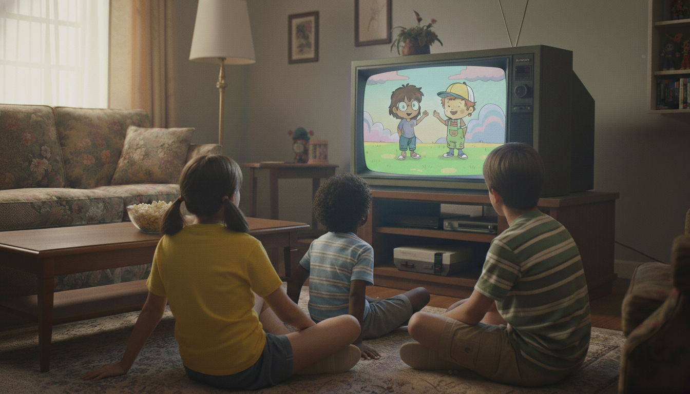
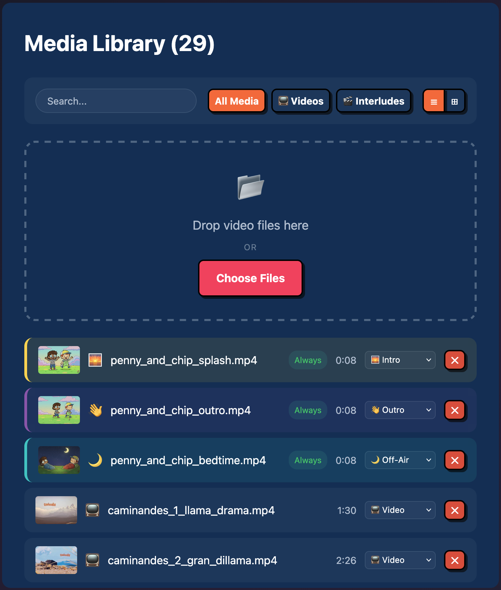
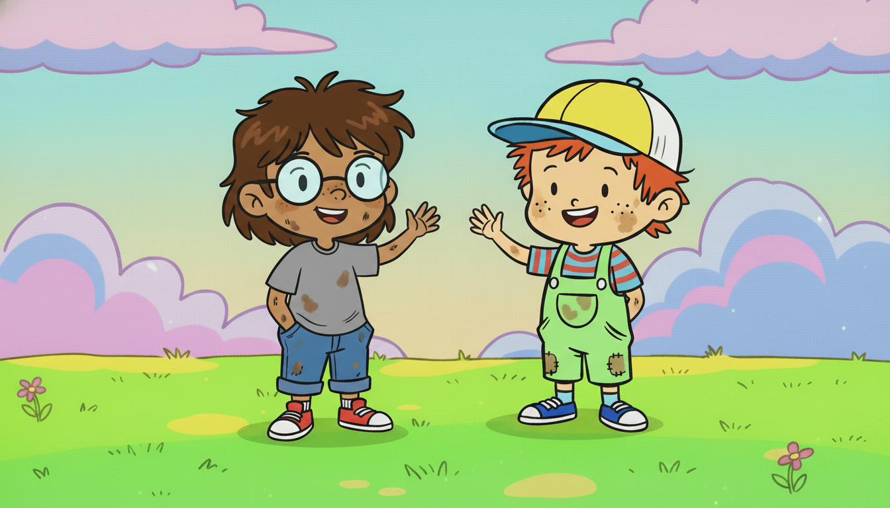

#  ToastTV

**The warm, crispy, 90s TV experience for your Raspberry Pi.**

No more "what should we watch?" — **Turn it on, and the station is already running.**

The anti-algorithm for tired parents and kids who just want to watch cartoons.



## Install (Raspberry Pi)

```bash
TODO
```

## Getting Started

Once installed, your station needs content:

- **Web UI**: Upload videos directly at `http://<your-pi-ip>:1993`
- **Manual**: Copy files to `/opt/toasttv/media/videos/` and restart

## Broadcast Control Center

The dashboard puts you in the director's chair:

| **Library Management** | **Bedtime Enforcement** |
|:---:|:---:|
| Upload videos, categorize content, and toggle interludes instantly. | One tap to "Sign Off" manually, or set automatic daily limits. |
| <a href="docs/library.png"></a> | <a href="docs/off_air.png"></a> |

## Why It's Better Than a Playlist

- **Smart Channel Engine**: ToastTV builds a dynamic "Channel" schedule: `[Intro] → [Video] → [Video] → [Interlude] → [Video]`.
- **Screen Time Limits**: Set a daily quota (e.g. 45 mins). When time is up, the station plays the sign-off sequence and stops. No arguments.
- **Seasonal Awareness**: Christmas interludes in December, Spooky bumpers in October. The engine tracks dates automatically—zero config required.
- **Native VLC Power**: Plays MKV, AVI, MP4 directly with hardware acceleration. No transcoding, no buffering, rock-solid sync.
- **Living Room Ready**: Put the keyboard away. Use your **actual TV remote** (Play/Pause/Skip) via HDMI-CEC.

### Starter Content

ToastTV works out of the box. It includes a full "broadcast day" so you can test the flow immediately:

Three episodes of **[Caminandes](https://studio.blender.org/films/caminandes-1/)** (by Blender Studio, CC-BY) are included.

The mascots **Penny & Chip** are ready to run your station.
- **Good morning!** — Penny signs on.
- **Bumpers** — Chip keeps the flow moving.
- **Bedtime** — Penny signs off.
- **Seasonal** — They even celebrate holidays.




## Tech Stack

Built with simplicity and performance in mind:

- **Runtime**: [Bun](https://bun.sh) (Fast all-in-one JavaScript runtime)
- **Server**: [Hono](https://hono.dev) (Lightweight web framework)
- **Database**: [SQLite](https://sqlite.org) (Zero-dependency, embedded)
- **Player**: [VLC](https://www.videolan.org) (Native hardware decoding via RC interface)

For a deep dive into the code structure and design decisions, see [ARCHITECTURE.md](./ARCHITECTURE.md).

## Development

```bash
make install   # Install Bun, VLC, FFmpeg
make start     # Start VLC + server
make dev       # Start with watch mode
make test      # Run tests
```

## License

MIT
